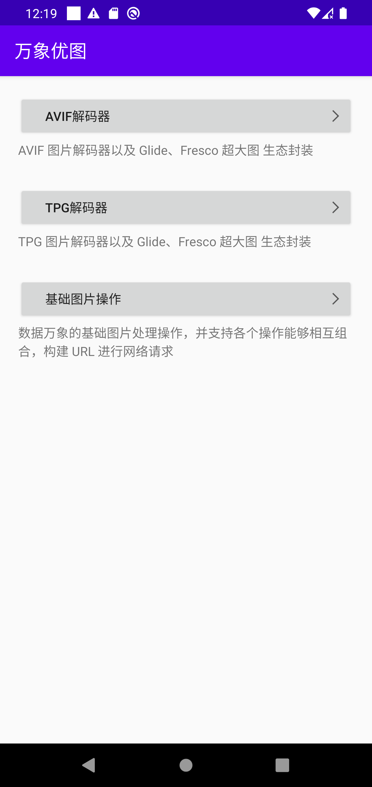
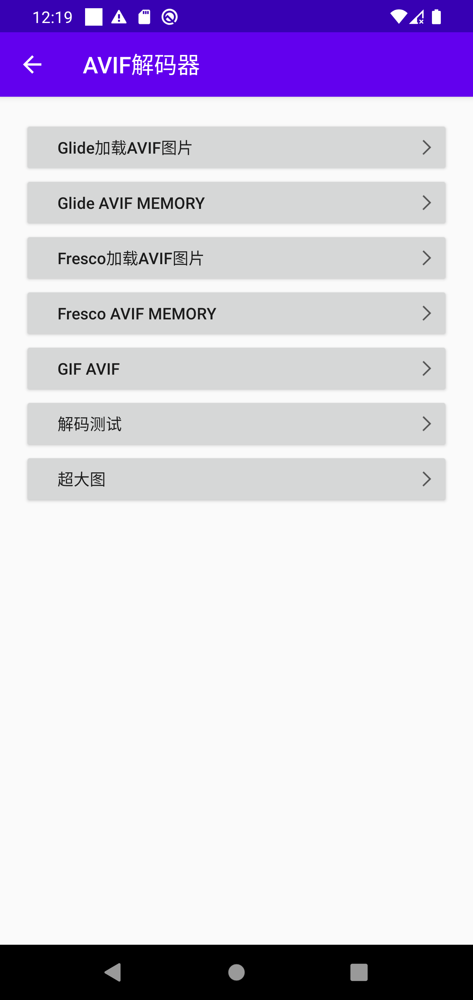
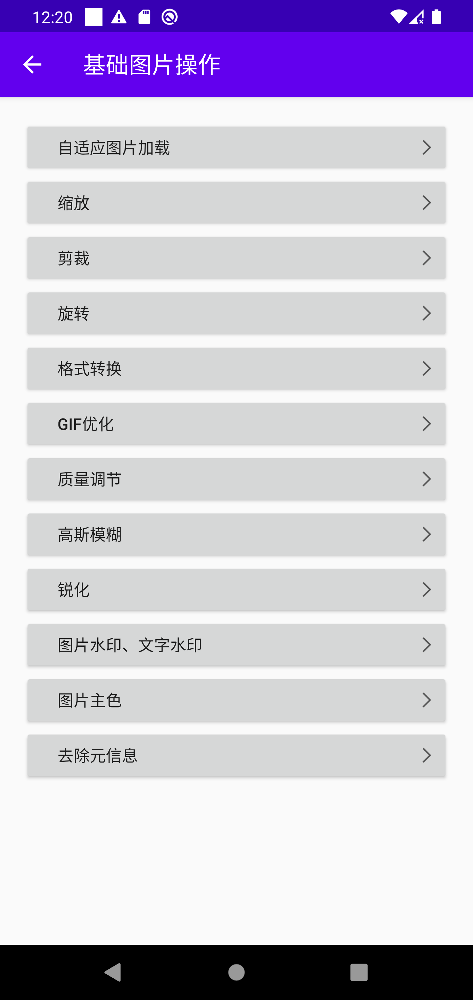

# 数据万象图片 SDK 示例

## 简介

CI Android SDK 主要提供 AVIF 和 TPG 的图像解码、图片网络加载优化、图片基础处理与变换等能力。
并且针对常用图片框架 Glide、Fresco 等做了相关封装，方便用户快速接入。

|模块|功能
|:--:|:--
|AVIF|AVIF 图片解码器以及 Glide、Fresco 等生态封装。
|TPG|TPG 图片解码器以及 Glide、Fresco 等生态封装。
|qcloud-decoder-network|用于网络优化的 QCloud 网络库以及 Glide、Fresco 生态封装。
|cloud-infinite|该模块包含数据万象的基础图片处理操作，并支持各个操作能够相互组合，构建 URL 进行网络请求。

>?
>- 图片压缩瘦身介绍请参见 [图片压缩瘦身](https://cloud.tencent.com/act/pro/pictureSlimming)。
>- CDN 云闪图片分发介绍请参见 [云闪图片分发](https://cloud.tencent.com/solution/image-delivery)。
>- 关于 AVIF 的更多介绍，请参见 [AVIF 功能介绍](https://cloud.tencent.com/document/product/460/60527)。
>- 关于 TPG 的更多介绍，请参见 [TPG 功能介绍](https://cloud.tencent.com/document/product/460/60526)。

## 准备工作

1. 您需要一个 Android 应用，这个应用可以是您现有的工程，也可以是您新建的一个空的工程。
2. 请确保应用基于 Android 4.0.3 及以上版本的 SDK 构建。

## 集成与使用

根据您需要的模块查看具体的使用文档，进行集成和使用。

AVIF 解码器：
- AVIF 解码器基础使用，请参见 [AVIF 解码器](https://cloud.tencent.com/document/product/460/87904)。
- Glide 加载 AVIF，请参见 [Glide 加载 AVIF](https://cloud.tencent.com/document/product/460/87905)。
- Fresco 加载 AVIF，请参见 [Fresco 加载 AVIF](https://cloud.tencent.com/document/product/460/87906)。
- 加载超大图 AVIF，请参见 [加载超大图 AVIF](https://cloud.tencent.com/document/product/460/87907)。

TPG 解码器：
- TPG 解码器基础使用，请参见 [TPG 解码器](https://cloud.tencent.com/document/product/460/87909)。
- Glide 加载 TPG，请参见 [Glide 加载 TPG](https://cloud.tencent.com/document/product/460/87910)。
- Fresco 加载 TPG，请参见 [Fresco 加载 TPG](https://cloud.tencent.com/document/product/460/87911)。
- 加载超大图 TPG，请参见 [加载超大图 TPG](https://cloud.tencent.com/document/product/460/87912)。

数据万象的图片基础处理：
- 图片基础处理，请参见 [图片基础处理](https://cloud.tencent.com/document/product/460/87914)。

## 感谢
使用过程中如果您遇到了问题或者有更好的建议欢迎提 issue以及pull request

## License
~~~
Copyright (c) 2010-2020 Tencent Cloud. All rights reserved.

Permission is hereby granted, free of charge, to any person obtaining a copy
of this software and associated documentation files (the "Software"), to deal
in the Software without restriction, including without limitation the rights
to use, copy, modify, merge, publish, distribute, sublicense, and/or sell
copies of the Software, and to permit persons to whom the Software is
furnished to do so, subject to the following conditions:

The above copyright notice and this permission notice shall be included in all
copies or substantial portions of the Software.

THE SOFTWARE IS PROVIDED "AS IS", WITHOUT WARRANTY OF ANY KIND, EXPRESS OR
IMPLIED, INCLUDING BUT NOT LIMITED TO THE WARRANTIES OF MERCHANTABILITY,
FITNESS FOR A PARTICULAR PURPOSE AND NONINFRINGEMENT. IN NO EVENT SHALL THE
AUTHORS OR COPYRIGHT HOLDERS BE LIABLE FOR ANY CLAIM, DAMAGES OR OTHER
LIABILITY, WHETHER IN AN ACTION OF CONTRACT, TORT OR OTHERWISE, ARISING FROM,
OUT OF OR IN CONNECTION WITH THE SOFTWARE OR THE USE OR OTHER DEALINGS IN THE
SOFTWARE.
~~~

## 示例
完整示例请参考QCloudInfiniteSample示例工程

