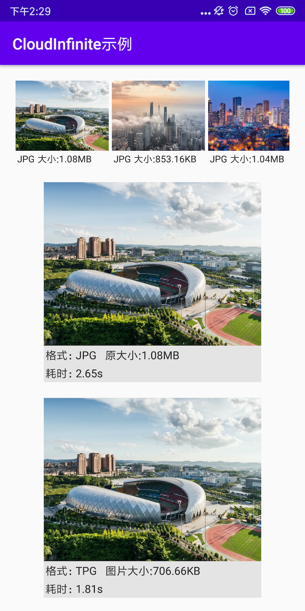

# cloud-Infinite-sdk-android
**数据万象** 是腾讯云为客户提供的专业一体化的图片解决方案，涵盖图片上传、下载、存储、处理、识别等功能，目前数据万象提供图片缩放、裁剪、水印、转码、内容审核等多种功能，提供高效准确的图像识别及处理服务，减少人力投入，真正地实现人工智能 [了解更多](https://cloud.tencent.com/document/product/460)。

**云闪图片分发** 是传统CDN集成数据万象丰富的图片压缩方式，在保证视觉效果的基础上，大幅降低图片流量/带宽。在海量图片业务场景下，提升页面加载速率，实现极致节流 [了解更多](https://cloud.tencent.com/solution/image-delivery)。

**TPG** 是腾讯推出的自研图片格式，可将 JPG、PNG、GIF、WEBP 等格式图片转换为 TPG 格式，大幅减小图片大小。从而减小图片体积，快速加载图片，节省流量 [了解更多](https://cloud.tencent.com/document/product/460/43680)。

为了使开发者更方便快速是使用数据万象和云闪图片分发功能，我们提供了4个SDK，开发者可根据具体需求进行选择。

序号|模块|功能
--:|:--:|:--
1|cloud-infinite|根据用户对图片的操作构建图片加载请求 [详细介绍](https://github.com/tencentyun/cloud-Infinite-sdk-android/tree/master/QCloudInfinite/cloudInfinite)
2|cloud-infinite-loader|一个基于cloud-infinite实现的简易ImageLoader [详细介绍](https://github.com/tencentyun/cloud-Infinite-sdk-android/tree/master/QCloudInfinite/cloudInfiniteLoader)
3|tpg|TPG图片封装，方便用户直接使用TPG图片 [详细介绍](https://github.com/tencentyun/cloud-Infinite-sdk-android/tree/master/QCloudTpgImage/tpgimage)
4|tpg-glide|TPG图片的glide插件，方便在glide中直接使用TPG [详细介绍](https://github.com/tencentyun/cloud-Infinite-sdk-android/tree/master/QCloudTpgImage/tpgimage_glide)

# 安装SDK
推荐使用Gradle进行安装
~~~
 implementation 'com.tencent.qcloud:cloud-infinite:1.0.0'			
 implementation 'com.tencent.qcloud:tpg:1.0.0'			             	              
~~~

使用tpg或tpg\-glide时，安装时会自动包含SO库，建议在Module的build.gradle文件中使用NDK的“abiFilter”配置，设置支持的SO库架构
~~~
defaultConfig {
    ndk {
        // 设置支持的SO库架构
        abiFilters 'armeabi' //, 'x86', 'armeabi-v7a', 'x86_64', 'arm64-v8a'
    }
~~~

# 使用场景
## 1. 加载数据万象的 TPG 图片
### 使用 Glide 加载

1. 安装tpg-glide sdk
~~~
implementation 'com.tencent.qcloud:tpg-glide:1.0.0'
~~~

2. 创建AppGlideModule，注册CIImageRequestModelLoader和TpgDecoder
~~~
/**
 * 注册自定义GlideModule 
 * 开发者应该创建此类注册CIImageRequestModelLoader和TpgDecoder 
 * 类库开发者可以继承LibraryGlideModule创建类似的注册类
 */
@GlideModule
public class MyAppGlideModule extends AppGlideModule {
    @Override
    public void registerComponents(@NonNull Context context, @NonNull Glide glide, Registry registry) {
        //注册支持CIImageLoadRequest的loader
        registry.prepend(CIImageLoadRequest.class, InputStream.class, new CIImageRequestModelLoader.Factory());
        //注册TPG图片解码器
        registry.prepend(InputStream.class, Bitmap.class, new TpgDecoder(glide.getBitmapPool()));
    }
}
~~~

3. 使用Glide加载图片请求
~~~
//创建数据万象操作器
CloudInfinite cloudInfinite = new CloudInfinite();
//根据原始URL和要进行的操作CITransformation，生成图片加载请求CIImageLoadRequest
cloudInfinite.requestWithBaseUrl(image.url, new CITransformation().format(CIImageFormat.TPG, CIImageLoadOptions.LoadTypeAcceptHeader), neCloudInfiniteCallback() {
    @Override
    public void onImageLoadRequest(@NonNull CIImageLoadRequest request) {
        //使用glide加载CIImageLoadRequest
        Glide.with(activity).load(request).into(imageview);
    }
});
~~~

### 使用其他第三方或者自定义图片加载库加载
~~~
//创建数据万象操作器
CloudInfinite cloudInfinite = new CloudInfinite();
//根据原始URL和要进行的操作CITransformation，生成图片加载请求CIImageLoadRequest
cloudInfinite.requestWithBaseUrl(url, new CITransformation().format(CIImageFormat.TPG, CIImageLoadOptions.LoadTypeAcceptHeader), neCloudInfiniteCallback() {
    @Override
    public void onImageLoadRequest(@NonNull CIImageLoadRequest request) {
        //使用自定义图片加载库或者第三方图片库等对CIImageLoadRequest进行加载并解码显示

        /*---------伪代码-----------*/
        //自定义图片loader通过CIImageLoadRequest获取到byte[]
        byte[] bytes = XXXImageLoader.load(request);
        //通过TpgImageLoader对byte[]进行解码
        Bitmap bitmap = TpgImageLoader.decode(bytes);
        //显示图片
        imageview.setImageBitmap(bitmap);
        /*---------伪代码-----------*/
    }
});
~~~

### 使用自带的 Loader 加载
cloud-infinite-loader只是简易的封装了基础的图片下载，没有缓存、生命周期等图片库功能，不建议直接在项目中使用，推荐使用Glide等成熟的图片库

1. 安装cloud-infinite-loader sdk
~~~
implementation 'com.tencent.qcloud:cloud-infinite-loader:1.0.0'
~~~

2. 加入INTERNET权限
~~~
<uses-permission android:name="android.permission.INTERNET" />
~~~

3. 代码加载
~~~
//创建数据万象操作器
CloudInfinite cloudInfinite = new CloudInfinite();
//根据原始URL和要进行的操作CITransformation，生成图片加载请求CIImageLoadRequest
cloudInfinite.requestWithBaseUrl(image.url, new CITransformation().format(CIImageFormat.TPG, CIImageLoadOptions.LoadTypeAcceptHeader), neCloudInfiniteCallback() {
    @Override
    public void onImageLoadRequest(@NonNull CIImageLoadRequest request) {
        //使用CIImageLoader加载TPG图片
        CIImageLoader ciImageLoader = new CIImageLoader();
        ciImageLoader.loadData(request, new CIImageLoadDataCallBack() {
            @Override
            public void onLoadData(byte[] bytes) {
                TpgImageLoader.displayWithData(imageview, bytes);
            }

            @Override
            public void onFailure(QCloudClientException clientExceptionQCloudServiceException serviceException) {

            }
        });
    }
});
~~~

## 加载本地 TPG 图片
assets、drawable、row使用TPG图片有利于减小安装包大小
~~~
//加载Assets中TPG图片
TpgImageLoader.displayWithAssets(imageview, assetsName);
//加载Resource中TPG图片
TpgImageLoader.displayWithResource(imageview, R.drawable.tpg);
//加载本地文件中的TPG图片
TpgImageLoader.displayWithFileUri(imageview, fileUri);
~~~

# 示例
完整示例请参考QCloudInfiniteSample示例工程

# 变更记录
#### Version 1.0.0
##### 2020-07-29
首次发布 TPG图片加载功能

# 感谢
使用过程中如果您遇到了问题或者有更好的建议欢迎提 issue以及pull request

# License
~~~
Copyright (c) 2010-2020 Tencent Cloud. All rights reserved.

Permission is hereby granted, free of charge, to any person obtaining a copy
of this software and associated documentation files (the "Software"), to deal
in the Software without restriction, including without limitation the rights
to use, copy, modify, merge, publish, distribute, sublicense, and/or sell
copies of the Software, and to permit persons to whom the Software is
furnished to do so, subject to the following conditions:

The above copyright notice and this permission notice shall be included in all
copies or substantial portions of the Software.

THE SOFTWARE IS PROVIDED "AS IS", WITHOUT WARRANTY OF ANY KIND, EXPRESS OR
IMPLIED, INCLUDING BUT NOT LIMITED TO THE WARRANTIES OF MERCHANTABILITY,
FITNESS FOR A PARTICULAR PURPOSE AND NONINFRINGEMENT. IN NO EVENT SHALL THE
AUTHORS OR COPYRIGHT HOLDERS BE LIABLE FOR ANY CLAIM, DAMAGES OR OTHER
LIABILITY, WHETHER IN AN ACTION OF CONTRACT, TORT OR OTHERWISE, ARISING FROM,
OUT OF OR IN CONNECTION WITH THE SOFTWARE OR THE USE OR OTHER DEALINGS IN THE
SOFTWARE.
~~~